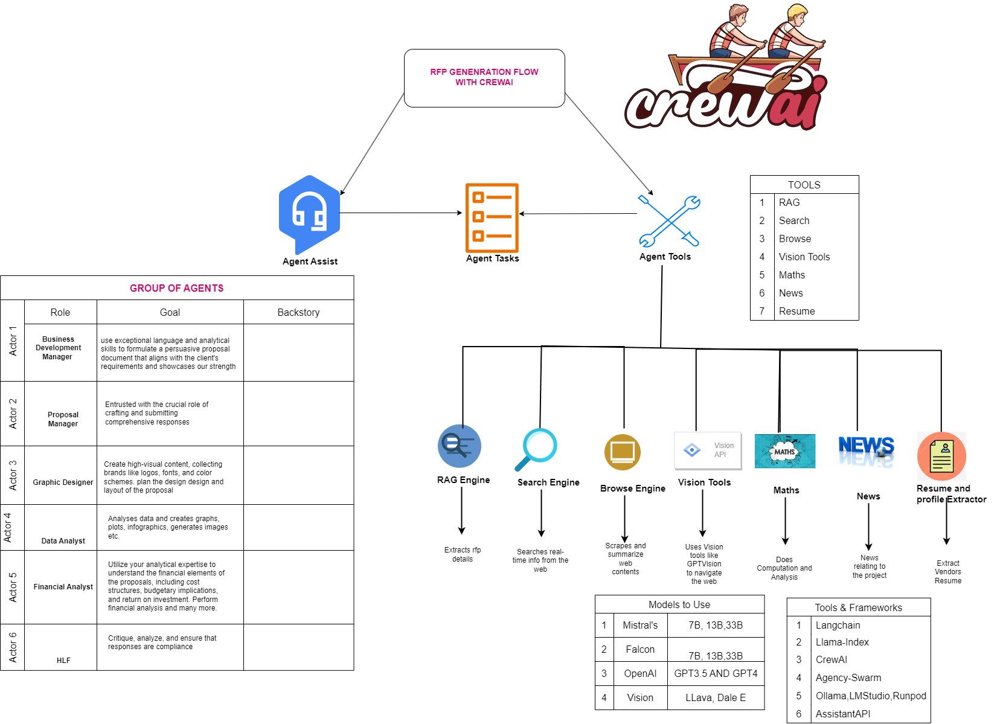

1. ```cd to rfp folder```
2. run  `pip install -r requirements.txt`
3. if you are runing the script in a jupyter terminal you can run the main.py file line by line
4. on vscode terminal run `python main.py`

<p align="center"> 
  <kbd>
    <a href="https://github.com/okoliechykwuka/RFP-AGENT-CREW/edit/main/" target="_blank">
  </a>
  </kbd>
</p>


place the files `app.py` and `utility.py` and the `utils` folder in the rfp folder. They should be at the same level as main.py
What was change in the util.py was the `visualize` function was made to return a fig


Note:
1. All table data is expected to be return as raw data (list of list) rather than `tabulate(table)`

make sure pdfkit is installed
download and install wkhtmltopdf https://wkhtmltopdf.org/downloads.html
add  "C:\Program Files\wkhtmltopdf\bin" tp system path
run cmd
$ pip install -r requirements.txt
$ streamlit run app.py


### Steps to run the app via docker

1. pull docker image from the hub https://hub.docker.com/repository/docker/chukypedro15/rfp_engine/general
  `docker pull chukypedro15/rfp_engine:1.0`   
2. Run  `docker run -d -p 8501:8501 rfp-image` and navigate to `http://localhost:8501`

3. You can navigate to the localhost endpoint and interact with the application.


```
RRRR   FFFF   PPPP          A    IIIII        SSS   Y   Y   SSS   TTTTT  EEEE   M   M  
R   R  F      P   P        A A     I         S       Y Y   S        T    E      MM MM  
RRRR   FFF    PPPP        AAAAA    I          SSS     Y     SSS     T    EEE    M M M  
R R    F      P           A   A    I             S    Y        S    T    E      M   M  
R  RR  F      P           A   A  IIIII        SSS     Y     SSS     T    EEEE   M   M  
